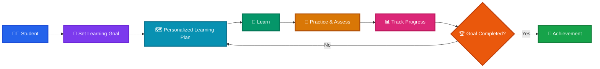
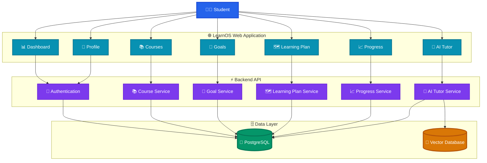
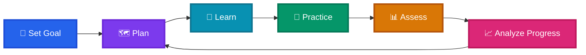
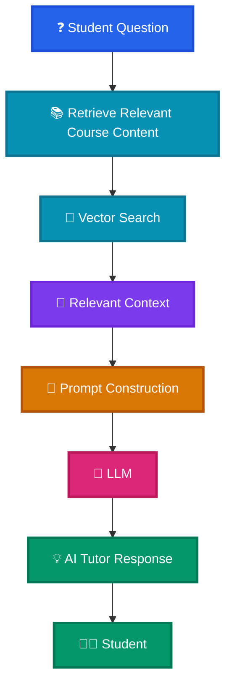
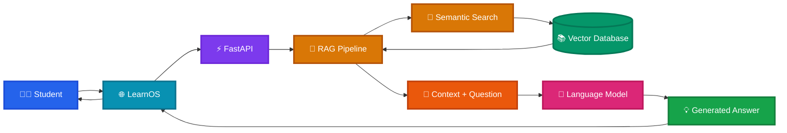
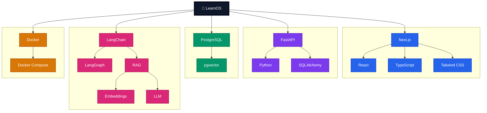
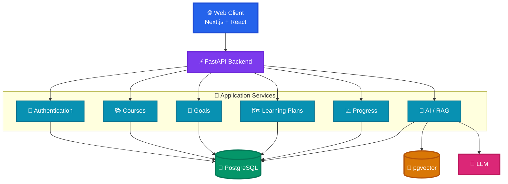
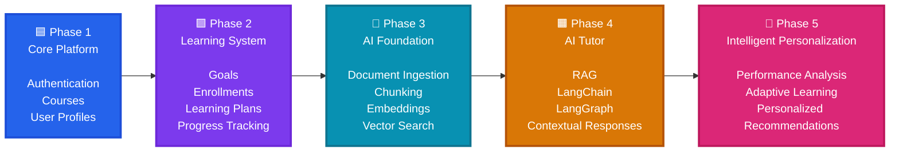

# 🧠 LearnOS

> **Learn smarter. Learn your way.**

**LearnOS** is an intelligent learning platform designed to help students set goals, follow personalized learning paths, learn through structured course content, interact with an AI Tutor, and track their progress.

---

## ✨ Vision

LearnOS aims to turn a traditional course-based learning experience into a **personalized learning journey**.

---

## 🎯 Core Features

| Feature | Description |
|---|---|
| 🎯 **Learning Goals** | Students define what they want to achieve. |
| 📚 **Courses** | Structured courses organized into learning content. |
| 🗺️ **Learning Plan** | Generates a structured path toward the student's goal. |
| 🤖 **AI Tutor** | Provides contextual assistance while learning. |
| 📊 **Progress Tracking** | Tracks learning activity and completion. |
| 🧠 **Personalization** | Adapts the learning journey around goals and performance. |

---

## 🏗️ Platform Overview

---

## 🔄 Learning Journey

The central idea of LearnOS is a continuous learning loop.

---

## 🤖 AI Tutor

The AI Tutor is designed to provide learning assistance based on the available course material rather than acting as a generic chatbot.

### AI Learning Flow

---

## 📄 Knowledge / RAG Pipeline

Course documents can be transformed into searchable knowledge for the AI Tutor.

```mermaid
flowchart LR
    A["📄 Course Documents"] --> B["📑 Text Extraction"]
    B --> C["✂️ Chunking"]
    C --> D["🧠 Embeddings"]
    D --> E[("🔎 Vector Database")]

    Q["❓ Student Query"] --> F["🧠 Query Embedding"]
    F --> E
    E --> G["📚 Relevant Chunks"]
    G --> H["🤖 LLM"]
    H --> I["💡 Contextual Answer"]

    classDef docs fill:#2563EB,stroke:#1D4ED8,color:#FFFFFF,stroke-width:3px;
    classDef process fill:#0891B2,stroke:#0E7490,color:#FFFFFF,stroke-width:3px;
    classDef embedding fill:#7C3AED,stroke:#6D28D9,color:#FFFFFF,stroke-width:3px;
    classDef database fill:#059669,stroke:#047857,color:#FFFFFF,stroke-width:3px;
    classDef query fill:#D97706,stroke:#B45309,color:#FFFFFF,stroke-width:3px;
    classDef relevant fill:#EA580C,stroke:#C2410C,color:#FFFFFF,stroke-width:3px;
    classDef llm fill:#DB2777,stroke:#BE185D,color:#FFFFFF,stroke-width:3px;
    classDef answer fill:#16A34A,stroke:#15803D,color:#FFFFFF,stroke-width:3px;

    class A docs;
    class B,C process;
    class D,F embedding;
    class E database;
    class Q query;
    class G relevant;
    class H llm;
    class I answer;
```

---

## 🧩 Technology Stack

---

## 🔐 High-Level Architecture

---

## 👨‍🎓 Student Experience

```mermaid
flowchart LR
    A["🔵 Create Account"] --> B["🔵 Select Course"]
    B --> C["🟣 Define Goal"]
    C --> D["🟣 Follow Learning Plan"]
    D --> E["🩵 Study Course Material"]
    E --> F["🩷 Ask AI Tutor"]
    F --> G["🟠 Practice"]
    G --> H["🟠 Take Assessment"]
    H --> I["🟢 Review Progress"]
    I --> J["🟢 Identify Weak Areas"]
    J --> D

    classDef setup fill:#2563EB,stroke:#1D4ED8,color:#FFFFFF,stroke-width:3px;
    classDef learning fill:#7C3AED,stroke:#6D28D9,color:#FFFFFF,stroke-width:3px;
    classDef material fill:#0891B2,stroke:#0E7490,color:#FFFFFF,stroke-width:3px;
    classDef tutor fill:#DB2777,stroke:#BE185D,color:#FFFFFF,stroke-width:3px;
    classDef assess fill:#D97706,stroke:#B45309,color:#FFFFFF,stroke-width:3px;
    classDef improve fill:#059669,stroke:#047857,color:#FFFFFF,stroke-width:3px;

    class A,B,C setup;
    class D learning;
    class E material;
    class F tutor;
    class G,H assess;
    class I,J improve;
```

---

## 🚀 Development Roadmap

---

## 💡 What Makes LearnOS Different?

LearnOS is built around the idea that **learning should be a continuous feedback loop**.

Instead of:

> Course → Content → Finish

LearnOS aims for:

> **Goal → Plan → Learn → Practice → Assess → Analyze → Adapt → Learn**

This architecture creates a foundation for progressively introducing more intelligent personalization as the platform evolves.

---

## 📌 Project Summary

**LearnOS** is an AI-powered learning platform that combines:

- 🎯 Goal-oriented learning
- 🗺️ Personalized learning plans
- 📚 Structured course content
- 🤖 AI-assisted learning
- 🔎 Retrieval-Augmented Generation
- 📊 Progress tracking
- 🔄 Continuous learning feedback

The long-term vision is to build a **personal learning operating system** that helps students understand *what to learn, how to learn it, and what to do next*.

---

## 🛠️ Project Status

> 🚧 **Active Development**

LearnOS is being developed as an evolving project, with the current focus on building the core learning platform and AI-powered learning infrastructure.

---

## 👥 Team

**Team:** Code of Duty  
**Project:** LearnOS  
**Built during:** College Hackathon organized by the Hack Club

---

## 🧠 LearnOS

**Learn smarter. Learn your way. 🚀**
